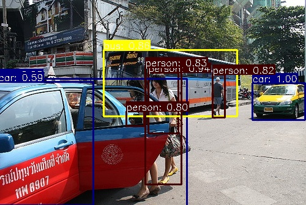

# Object Detection from Scratch

A custom **Faster R-CNN with FPN** implementation trained entirely from scratch on PASCAL VOC 2007.



## Results

| Metric | Value |
|--------|-------|
| **mAP@0.5** | 44.96% |
| **mAP@0.75** | 17.77% |
| **mAP@0.5:0.95** | 21.75% |
| **FPS (L40s GPU)** | 56.9 |
| **Parameters** | 41.45M |
| **Model Size** | 166 MB |

### Per-Class Performance (AP@0.5)

| Class | AP | Class | AP |
|-------|-----|-------|-----|
| car | 66.0% | person | 64.9% |
| train | 64.3% | horse | 63.2% |
| bus | 60.9% | aeroplane | 55.8% |
| bicycle | 55.1% | motorbike | 54.8% |
| cat | 50.5% | tvmonitor | 46.0% |
| cow | 45.0% | diningtable | 39.3% |
| sofa | 38.6% | dog | 37.6% |
| sheep | 36.6% | bird | 32.3% |
| boat | 30.5% | chair | 26.5% |
| pottedplant | 18.5% | bottle | 12.8% |

## Features

- **ResNet-50 backbone** with Group Normalization (better for small batch training)
- **Feature Pyramid Network (FPN)** with P2-P6 for multi-scale detection
- **Region Proposal Network (RPN)** with multi-scale anchors
- **ROI Align** for precise feature extraction
- **Mosaic augmentation** for improved small object detection
- Mixed precision training (FP16)
- Cosine annealing LR with warmup

## Project Structure

```
Task1_ObjectDetection/
├── models/
│   ├── backbone.py      # ResNet-50 with GroupNorm
│   ├── fpn.py           # Feature Pyramid Network (P2-P6)
│   ├── rpn.py           # Region Proposal Network
│   ├── roi_head.py      # Detection head with ROI Align
│   └── faster_rcnn.py   # Complete model
├── datasets/
│   ├── voc_dataset.py   # VOC loader + Mosaic augmentation
│   └── augmentations.py # Data augmentation
├── utils/
│   ├── boxes.py         # Box utilities (IoU, NMS, encoding)
│   ├── anchors.py       # Multi-scale anchor generation
│   ├── losses.py        # RPN + detection losses
│   └── metrics.py       # mAP calculation
├── train.py             # Training script
├── evaluate.py          # Evaluation script
├── inference.py         # Single image inference
├── visualize.py         # Batch visualization
├── export_onnx.py       # ONNX export
├── export_torchscript.py# TorchScript export
└── config.py            # Configuration
```

## Quick Start

### Setup

```bash
pip install -r requirements.txt
python data/download_voc.py
```

### Training

```bash
# Train from scratch (80 epochs)
python train.py --epochs 80 --batch_size 16

# Resume training
python train.py --resume outputs/latest.pth
```

### Evaluation

```bash
python evaluate.py --checkpoint outputs/best.pth
```

### Inference

```bash
# Single image
python inference.py --checkpoint outputs/best.pth --image path/to/image.jpg --output result.jpg

# Batch visualization (20 samples)
python visualize.py --checkpoint outputs/best.pth --num_samples 20
```

### Export

```bash
# ONNX (for TensorRT/OpenVINO)
python export_onnx.py --checkpoint outputs/best.pth

# TorchScript (for mobile/edge)
python export_torchscript.py --checkpoint outputs/best.pth
```

## Training Configuration

| Parameter | Value |
|-----------|-------|
| Image size | 448×448 |
| Batch size | 16 |
| Epochs | 80 (best at 49) |
| Optimizer | SGD |
| Learning rate | 0.04 |
| Momentum | 0.9 |
| Weight decay | 0.0005 |
| Warmup | 2 epochs |
| LR schedule | Cosine annealing |
| Gradient clipping | 1.0 |

## Key Design Decisions

1. **Group Normalization** instead of Batch Norm — stable with small batches
2. **FPN with P6** — better large object detection
3. **Mosaic Augmentation** — 50% probability during training
4. **Training from scratch** — no pretrained weights used

## Requirements

- Python 3.8+
- PyTorch 2.0+
- torchvision
- OpenCV
- tqdm
- Pillow

## Dataset

**PASCAL VOC 2007** — 20 object classes, 9,963 images
- Train: 2,501 images
- Val: 2,510 images  
- Test: 4,952 images
- [Official Website](https://www.robots.ox.ac.uk/~vgg/projects/pascal/VOC/voc2007/index.html)

## References

```bibtex
@misc{pascal-voc-2007,
  author       = "Everingham, M. and Van~Gool, L. and Williams, C. K. I. and Winn, J. and Zisserman, A.",
  title        = "The {PASCAL} {V}isual {O}bject {C}lasses {C}hallenge 2007 {(VOC2007)} {R}esults",
  howpublished = "http://www.pascal-network.org/challenges/VOC/voc2007/workshop/index.html"
}
```

## License

MIT
